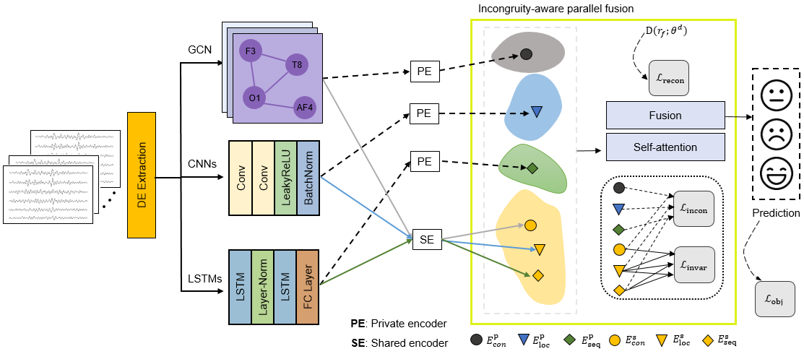

# COPA


<p align="center">
  
</p>

### Data Download and set up environments

 - [SEED](https://bcmi.sjtu.edu.cn/home/seed/seed.html)
 - [SEED-IV](https://bcmi.sjtu.edu.cn/home/seed/seed-iv.html#)


<tr>
  <td>SEED</td>
  <td>SEED-IV</td>
</tr>

### Running the code
```
python main.py --n_classes [num. classes] --dataset_dir [dir_path] --in_channels 5 --num_electrodes 62 --model_name COPA
```


### Citation

If this code is helpful for your research, please cite us at:

```
@article{Kang2026COPA,
  title={Incongruity-aware shared-private parallel fusion with selective feature passing for EEG-based emotion recognition},
  author={Kang, Hyunwook and Lee, Young-Eun and Lee, Minji},
  journal={Biomedical Signal Processing and Control},
  year={2026}
}
```

### Contact

For any questions, please email at [hyunwook.kang@catholic.ac.kr](mailto:hyunwook.kang@catholic.ac.kr)
